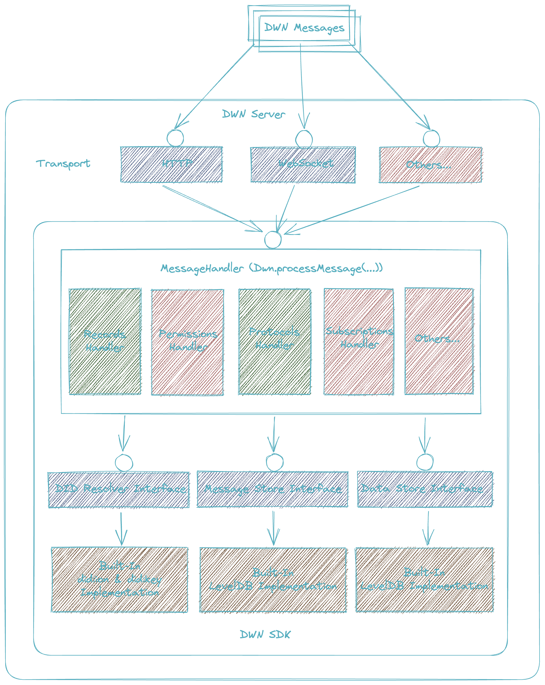

<!-- @format -->
# Decentralized Web Node (DWN) SDK <!-- omit in toc -->

[](https://www.npmjs.com/package/@tbd54566975/dwn-sdk-js)
[](https://codecov.io/github/TBD54566975/dwn-sdk-js)
[](https://github.com/tbd54566975/dwn-sdk-js/actions/workflows/npm-publish-unstable.yml)
[](https://github.com/tbd54566975/dwn-sdk-js/blob/main/LICENSE)
[](https://discord.com/channels/937858703112155166/1068273971432280196)


- [Introduction](#introduction)
- [Installation](#installation)
- [Additional Steps](#additional-steps)
  - [Node.js \<= 18](#nodejs--18)
  - [React Native](#react-native)
  - [Usage in Browser:](#usage-in-browser)
    - [Vanilla HTML / JS](#vanilla-html--js)
    - [Webpack \>= 5](#webpack--5)
    - [Vite](#vite)
    - [esbuild](#esbuild)
- [Usage](#usage)
- [Release/Build Process](#releasebuild-process)
  - [Stable Build](#stable-build)
  - [Unstable Build](#unstable-build)
- [Some projects that use this library:](#some-projects-that-use-this-library)
- [Architecture](#architecture)
- [Project Resources](#project-resources)


## Introduction

This repository contains a reference implementation of Decentralized Web Node (DWN) as per the [specification](https://identity.foundation/decentralized-web-node/spec/). This specification is in a draft state and very much so a WIP. For the foreseeable future, a lot of the work on DWN will be split across this repo and the [repo that houses the specification](https://github.com/decentralized-identity/decentralized-web-node). The current implementation does not include all interfaces described in the DWN spec, but is enough to begin building test applications.

This project is used as a dependency by several other projects.

Proposals and issues for the specification itself should be submitted as pull requests to the [spec repo](https://github.com/decentralized-identity/decentralized-web-node).

## Running online environment

Interested in contributing instantly? You can make your updates directly without cloning in the running CodeSandbox environment.

[](https://codesandbox.io/p/github/TBD54566975/dwn-sdk-js/main)

## Installation

If you are interested in using DWNs and web5 in your web app, you probably want to look at web5-js, instead of this repository. Head on over here: https://github.com/TBD54566975/web5-js.

For advanced users wishing to use this repo directly:

```bash
npm install @tbd54566975/dwn-sdk-js
```

## Additional Steps

This package has dependency on [`@noble/ed25519`](https://github.com/paulmillr/noble-ed25519#usage) and [`@noble/secp256k1`](https://github.com/paulmillr/noble-secp256k1#usage) v2, additional steps are needed for some environments:

### Node.js <= 18

```js
// node.js 18 and earlier,  needs globalThis.crypto polyfill
import { webcrypto } from "node:crypto";
// @ts-ignore
if (!globalThis.crypto) globalThis.crypto = webcrypto;
```

### React Native
Usage of DWN SDK in react native requires a bit of set up at the moment. To simplify, we've [published an npm package](https://www.npmjs.com/package/@tbd54566975/web5-react-native-polyfills) that can be used to set everything up. Follow the instructions to get started.

### Usage in Browser:

`dwn-sdk-js` requires 2 polyfills: `crypto` and `stream`. we recommend using `crypto-browserify` and `stream-browserify`. Both of these polyfills can be installed using npm. e.g. `npm install --save crypto-browserify stream-browserify`

#### Vanilla HTML / JS

DWN SDK includes a polyfilled distribution that can imported in a `module` script tag. e.g.

```html
<!DOCTYPE html>
<html lang="en">
<body>
  <script type="module">
     // Import necessary modules from external sources using ES6 modules.
    import { Dwn, DataStream, DidKeyResolver, Jws, RecordsWrite } from 'https://cdn.jsdelivr.net/npm/@tbd54566975/dwn-sdk-js@0.1.1/dist/bundles/dwn.js'
    import { MessageStoreLevel, DataStoreLevel, EventLogLevel } from 'https://cdn.jsdelivr.net/npm/@tbd54566975/dwn-sdk-js@0.1.1/dist/bundles/level-stores.js'

    // Create instances of various components from the imported modules.
    const messageStore = new MessageStoreLevel();
    const dataStore = new DataStoreLevel();
    const eventLog = new EventLogLevel();
    const dwn = await Dwn.create({ messageStore, dataStore, eventLog });

    // Generate a did:key DID (Decentralized Identifier).
    const didKey = await TestDataGenerator.generateDidKeyPersona();

    // Create some data to be stored.
    const encoder = new TextEncoder();
    const data = encoder.encode('Hello, World!');

    // Create a RecordsWrite message to be stored in DWN.
    const recordsWrite = await RecordsWrite.create({
      data,
      dataFormat: 'application/json',
      published: true,
      schema: 'yeeter/post',  // Specify a schema for the data.
      signer: Jws.createSigner(didKey) // Sign the data using the generated DID key.
    });

    // Create a readable stream from the data to be stored.
    const dataStream = DataStream.fromBytes(data);
    // Process the RecordsWrite message using the DWN instance.
    const result = await dwn.processMessage(didKey.did, recordsWrite.message, { dataStream });

    // Log the processing result status and perform an assertion.
    console.log(result.status);
    console.assert(result.status.code === 202)

    // Close the DWN instance, freeing up resources.
    await dwn.close()

  </script>
</body>

</html>
```

#### Webpack >= 5

Add the following to the top level of your webpack config (`webpack.config.js`)

```js
resolve: {
  fallback: {
    stream: require.resolve("stream-browserify"),
    crypto: require.resolve("crypto-browserify")
  }
}
```

#### Vite
Add the following to the top level of your vite config (`vite.config.js`)

```js
define: {
  global: 'globalThis'
},
resolve: {
  alias: {
    'crypto': 'crypto-browserify',
    'stream': 'stream-browserify'
  }
}
```

#### esbuild
We recommend using `node-stdlib-browser` instead of `crypto-browserify` and `stream-browserify` individually. Example usage:

```js
import esbuild from 'esbuild'
import stdLibBrowser from 'node-stdlib-browser'
import polyfillProviderPlugin from 'node-stdlib-browser/helpers/esbuild/plugin'

import { createRequire } from 'node:module';

const require = createRequire(import.meta.url);

// Build the project using esbuild.
esbuild.build({
  entryPoints: ['dwn-sdk-test.js'],
  platform: 'browser',
  bundle: true,
  format: 'esm',
  outfile: 'dist/dwn-sdk-test.js',

  // Inject the specified shim for Node.js standard library browser compatibility.
  inject      : [require.resolve('node-stdlib-browser/helpers/esbuild/shim')],
  // Use the polyfillProviderPlugin to provide polyfills for Node.js standard library.
  plugins     : [polyfillProviderPlugin(stdLibBrowser)],
  // Define 'global' as 'globalThis' to ensure compatibility with global objects.
  define      : {
    'global': 'globalThis'
  }
})
```

## Usage

[API docs](https://tbd54566975.github.io/dwn-sdk-js/)

```ts

import { Dwn, DataStream, DidKeyResolver, Jws, RecordsWrite } from '@tbd54566975/dwn-sdk-js';
import { DataStoreLevel, EventLogLevel, MessageStoreLevel } from '@tbd54566975/dwn-sdk-js/stores';

// Initialize the required stores and components for the DWN SDK.
const messageStore = new MessageStoreLevel();
const dataStore = new DataStoreLevel();
const eventLog = new EventLogLevel();
const dwn = await Dwn.create({ messageStore, dataStore, eventLog });

// Generate a did:key DID (Decentralized Identifier).
const didKey = await TestDataGenerator.generateDidKeyPersona();

// Create some data to be stored.
const encoder = new TextEncoder();
const data = encoder.encode('Hello, World!');

// Create a RecordsWrite message to be stored in the DWN.
const recordsWrite = await RecordsWrite.create({
  data,
  dataFormat: 'application/json',
  published: true, // Mark the data as published.
  schema: 'yeeter/post', // Specify a schema for the data.
  signer: Jws.createSigner(didKey) // Sign the data using the generated DID key.
});

// Create a readable stream from the data to be stored.
const dataStream = DataStream.fromBytes(data);
// Process the RecordsWrite message using the DWN instance.
const result = await dwn.processMessage(didKey.did, recordsWrite.message, { dataStream });
// Log the processing result status.
console.log(result.status);

```

With a web wallet installed:

```javascript
const result = await window.web5.dwn.processMessage({
  method: "RecordsQuery",
  message: {
    filter: {
      schema: "http://some-schema-registry.org/todo",
    },
    dateSort: "createdAscending",
  },
});
```

### Custom Tenant Gating
By default, all DIDs are allowed as tenants. A custom tenant gate implementation can be provided when initializing the DWN.
```ts
import { ActiveTenantCheckResult, Dwn, TenantGate, DataStoreLevel, EventLogLevel, MessageStoreLevel } from '@tbd54566975/dwn-sdk-js';

// Define a custom implementation of the TenantGate interface.
class CustomTenantGate implements TenantGate {
  public async isActiveTenant(did): Promise<ActiveTenantCheckResult> {
    // Custom implementation
  }
}

// Initialize the required stores and components for the DWN SDK.
const messageStore = new MessageStoreLevel();
const dataStore = new DataStoreLevel();
const eventLog = new EventLogLevel();
// Create an instance of the custom TenantGate.
const tenantGate = new CustomTenantGate();
// Create a DWN instance with configured stores, logs, and the custom TenantGate.
const dwn = await Dwn.create({ messageStore, dataStore, eventLog, tenantGate });
```

### Custom Signature Signer
If you have the private key readily available, it is recommended to use the built-in `PrivateKeySigner`. Otherwise, you can implement a customer signer to interface with external signing service, API, HSM, TPM etc and use it for signing your DWN messages:

```ts
// Create a custom signer implementing the Signer interface.
class CustomSigner implements Signer {
  public keyId = 'did:example:alice#key1'; // Specify the key ID.
  public algorithm = 'EdDSA'; // Specify the signing algorithm (valid `alg` value published).
  https://www.iana.org/assignments/jose/jose.xhtml
  public async sign (content: Uint8Array): Promise<Uint8Array> {
    ... // custom signing logic
  }
}

// Create an instance of the custom signer for authorization.
const signer = new CustomSigner();

// Define options for creating a RecordsWrite message.
const options: RecordsWriteOptions = {
  ...
  signer // Use the custom signer for authorization.
};

// Create a RecordsWrite message with the specified options.
const recordsWrite = await RecordsWrite.create(options);
```


## Release/Build Process

The DWN JS SDK releases builds to [npmjs.com](https://www.npmjs.com/package/@tbd54566975/dwn-sdk-js). There are two build types: stable build and unstable build.

### Stable Build

This is triggered manually by:

1.  Increment `version` in `package.json` in [Semantic Versioning (semver)](https://semver.org/) format.
2.  Merge the change into `main` branch
3.  Create a release from GitHub.

An official build with version matching the `package.json` will be published to [npmjs.com](https://www.npmjs.com/package/@tbd54566975/dwn-sdk-js).

### Unstable Build

Every push to the `main` branch will automatically trigger an unstable build to [npmjs.com](https://www.npmjs.com/package/@tbd54566975/dwn-sdk-js) for developers to experiment and test.

The version string contains the date as well as the commit hash of the last change.

An example version string:

`0.0.26-unstable-2023-03-16-36ec2ce`

- `0.0.26` came from `version` in `package.json`
- `2023-03-16` indicates the date of March 16th 2023
- `36ec2ce` is the commit hash of the last change

## Some projects that use this library:

- [Web5 JS SDK](https://github.com/TBD54566975/web5-js)
- [Example CLI](https://github.com/TBD54566975/dwn-cli)
- [Example with a web wallet](https://github.com/TBD54566975/incubating-web5-labs/)
- [Server side aggregator](https://github.com/TBD54566975/dwn-server)

## Architecture



> NOTE: The diagram is a conceptual view of the architecture, the actual component abstraction and names in source file may differ.

## Project Resources

| Resource                                                                                     | Description                                                                   |
| -------------------------------------------------------------------------------------------- | ----------------------------------------------------------------------------- |
| [CODEOWNERS](https://github.com/TBD54566975/dwn-sdk-js/blob/main/CODEOWNERS)                 | Outlines the project lead(s)                                                  |
| [CODE_OF_CONDUCT.md](https://github.com/TBD54566975/dwn-sdk-js/blob/main/CODE_OF_CONDUCT.md) | Expected behavior for project contributors, promoting a welcoming environment |
| [CONTRIBUTING.md](https://github.com/TBD54566975/dwn-sdk-js/blob/main/CONTRIBUTING.md)       | Developer guide to build, test, run, access CI, chat, discuss, file issues    |
| [GOVERNANCE.md](https://github.com/TBD54566975/dwn-sdk-js/blob/main/GOVERNANCE.md)           | Project governance                                                            |
| [LICENSE](https://github.com/TBD54566975/dwn-sdk-js/blob/main/LICENSE)                       | Apache License, Version 2.0                                                   |
| [Q_AND_A.md](https://github.com/TBD54566975/dwn-sdk-js/blob/main/Q_AND_A.md)                 | Questions and answers on DWN                                                  |
